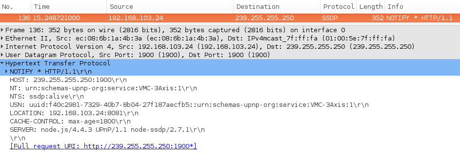
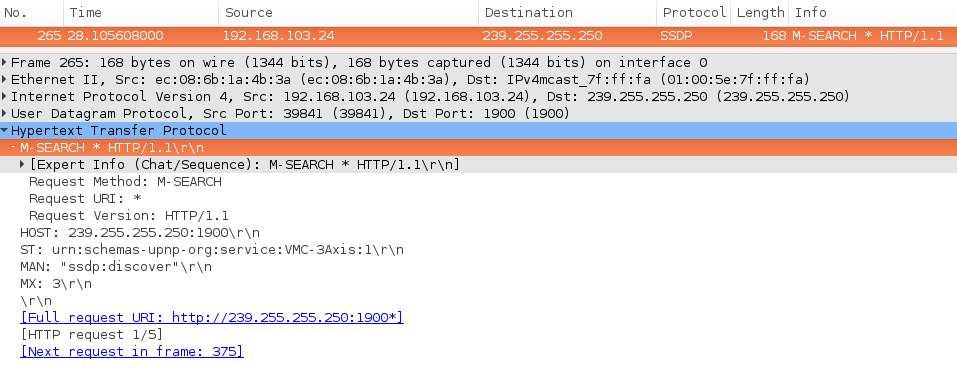
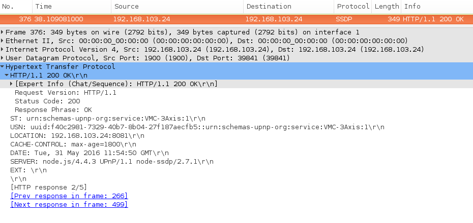

README
======

An implementation of the MTConnect Agent using Node.js.

INSTALL
-------

Install Node v6.2.0 or latest using NVM. A reference documentation is available at:

https://www.digitalocean.com/community/tutorials/how-to-install-node-js-on-an-ubuntu-14-04-server

Install required modules from the top-level directory using:

    $ npm install

In order to install the development dependencies use the following command:

    $ npm install --only=dev

You can then start the server using:

    $ npm start

DEPENDENCIES
------------

You will require xmllint for XML-XSD validation. On Ubuntu, you can install the same using:

    $ sudo apt-get install libxml2-utils

On Windows, install the GitHub client, and you can run the
script\install-Windows.sh script from a Git shell prompt. This will
fetch and copy the pre-compiled 32-bit binaries in
C:\tools\libxml. You will still need to update the PATH environment
variable with 'C:\tools\libxml'.

Simulator
---------

To run the adapter (simulator), use the following command:

    $ npm run simulator

The adapter will start sending UPnP NOTIFY messages in the network. It
will also contain LOCATION information providing the socket to read
data from.  A Wireshark capture is shown below:

You can start the agent as shown below:

    $ npm run agent

The agent will send UPnP M-SEARCH messages in the network. A sample
packet capture is given below:

The adapter will listen to M-SEARCH broadcasts, and if the Search
Target (ST) matches its description, it will respond with a ""HTTP/1.1
OK" message as illustrated below:

The agent will then connect to this adapter and will receive simulated
machine data. The following picture shows the agent receiving a
"execution ACTIVE" SHDR data.

Device schema
-------------
To get the Device schema. Run the agent and simulator in two command prompts.
Open a browser and type "http://localhost:8080/sampledevice.xml" in address bar.

/probe
-------
Run the simulator and agent in two command prompts as mentioned in section Simulator.
After observing the M-SEARCH response as 'HTTP/1.1 200 OK",
open a web browser and type "http://localhost:7000/probe" to get the agent's devices and
the device's dataItems.

To get the probe response of a particular device, specify the device name in the request.
Eg: "http://localhost:7000/VMC-3Axis/probe"

/current
--------
Run the simulator and agent in two command prompts as mentioned in section Simulator.
After observing the M-SEARCH response as 'HTTP/1.1 200 OK",
open a web browser and type "http://localhost:7000/current"
in the address bar to get the device detail with current values in XML format.
You can specify 'path' and 'at'.
Eg at: "http://localhost:7000/current?at=100"
   path: "http://localhost:7000/current?path=//Axes"
   path and at: "http://localhost:7000/current?path=//Axes&at=100"
In path you can specify type and subType also.
Eg: 'path=//Rotary//[subType="OVERRIDE"]' or 'path=//Rotary[Type="OVERRIDE"]'

To get current of a particular device - "http://localhost:7000/VMC-3Axis/current" or
specify 'path=//Device[@name="VMC-3Axis"]'
"VMC-3Axis" is the device name.

/sample
--------
Run the simulator and agent in two command prompts as mentioned in section Simulator.
After observing the M-SEARCH response as 'HTTP/1.1 200 OK",
open a web browser and type "http://localhost:7000/sample" in the adress bar to get the
sample - component's dataItems.

You can specify 'path' and 'from&count' also.
Eg: path:  "http://localhost:7000/sample?path=//Axes"
    from&count: "http://localhost:7000/sample?from=1037&count=6" PS: count should be within 10.
    path, from&count: "http://localhost:7000/sample?path=//Axes&from=1037&count=6"
To get sample of a particular device - "http://localhost:7000/VMC-3Axis/sample"
"VMC-3Axis" is the device name.

/assets or /assets
------------------
Run the simulator and agent in two command prompts as mentioned in section Simulator.
After observing the M-SEARCH response as 'HTTP/1.1 200 OK",
open a web browser and type "http://localhost:7000/assets" or "http://localhost:7000/asset"
in the address bar to get all the assets.

To get details of a particular asset specify its assetId in the url
Eg: http://localhost:7000/asset/EM233. PS: EM233 is the assetId

Similarly multiple assets can be specified by separating the assetIds by ';'.
Eg: http://localhost:7000/asset/EM233;EM262

Tests
-----

The unit and functional tests can be invoked using Mocha. An example
invocation is shown below:

    $ ./node_modules/mocha/bin/mocha test/adapterTest.js
    WARN: env.VI_VERSION not set unknown
    {"name":"svc-agent","loglevel":"warn","hostname":"foo","pid":26761,"level":30,"msg":"Starting machine TCP server on port 8081","time":"2016-06-06T08:59:33.222Z","v":0}
    {"name":"svc-agent","loglevel":"warn","hostname":"foo","pid":26761,"level":30,"msg":"Starting HTTP web server on port 8080","time":"2016-06-06T08:59:33.227Z","v":0}

      machineDataGenerator
        ✓ should return simulated values

      fileServer
        /public
          ✓ should return 200

      2 passing (32ms)

ESLint
------

The Airbnb JavaScript style guide is used as a reference. The eslint
linting tool can be run on the source code for validation. For
example:

    $ ./node_modules/eslint/bin/eslint.js src/adapter.js
    $

JSHint
------

The JavaScript code quality tool JSHint can be executed using the
following command:

    $ npm run jshint

Error and Exception Handling
----------------------------

The project includes error and exception handling code blocks to keep
the Agent running. You can test the simulator(adapter) and agent by
running them, and terminating each instance separately.

Docker
------

A Dockerfile has been added to the project. This allows us to:

1. Ship the Agent as a Docker image, and
2. Create a container environment in CI run the tests.

User Acceptance Testing (Standards)
-----------------------------------

You can generate the required integration/acceptance tests using the following command:

    $ ./node_modules/litpro/litpro.js doc/standard/upnp.md
    UNCHANGED ./build/upnp.js
    DONE: ./build

The above step will generate the required JavaScript files required to
run the tests. The actual invocation of the tests is illustrated
below:

    $ ./node_modules/mocha/bin/mocha build/upnp.js
    192.168.1.4
    WARN: env.VI_VERSION not set unknown
    {"name":"svc-agent","loglevel":"warn","hostname":"foo","pid":24639,"level":30,"msg":"Starting machine TCP server on port 8081","time":"2016-06-06T08:31:18.309Z","v":0}
    {"name":"svc-agent","loglevel":"warn","hostname":"foo","pid":24639,"level":30,"msg":"Starting HTTP web server on port 8080","time":"2016-06-06T08:31:18.313Z","v":0}

      machineDataGenerator
        ✓ should return simulated values

      1 passing (7ms)

The Standards document in Markdown format can be generated using the
provided generate-standard.js utility as shown below:

    $ cd tools
    $ node generate-standard.js

The generated Markdown file is available in the build/ folder.

Coverage
--------

Istanbul code coverage tool has been integrated with the project. You
can generate coverage HTML reports using:

    $ npm run tc:test
